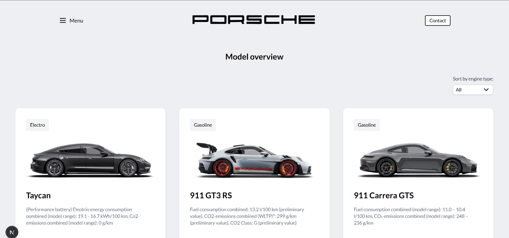

# Project Description

This project is responsive React/Next.js application that showcases different car models with the ability to filter by engine type (electric, hybrid, gasoline). Each model is displayed in a cutom card component that includes details such as an image, acceleration, power, top speed etc...

The app is built using React and Next.js, along with Tailwind CSS for a responsive and accessible design. It also has some of accessibility features such as including visible blue outlines on elements when focused via keyboard navigation (TAB).

# Technologies

- React 19.0.0
- Next.js v15.3.4
- TypeScript v5
- TailwindCSS v4
- HTML

  # Installation

  1. Clone this repository:
     git clone https://github.com/LukaD45/porsche-assignment-student.git

     cd porsche-assignment-student

  2. Install needed dependencies:
     npm install

  3. Start development server:
     npm run dev

  4. Open the app in browser:
     Usually it is located at http://localhost:3000/ but if that port is already in use check your IDE console to be certain

# Screenshots

